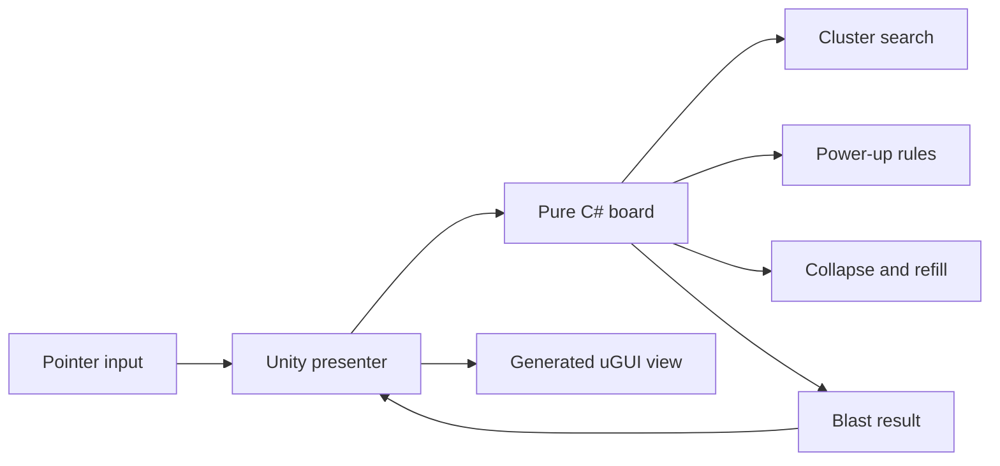

# Architecture

`BlastBoard` owns deterministic game rules and has no dependency on scenes,
frames or animation. The presenter translates a tile selection into a domain
operation, then renders the returned state. This keeps rule changes cheap to
test and lets animation remain a replaceable presentation concern.

## Deliberate constraints

- The demo uses a seeded xorshift generator so a failure can be reproduced.
- A connected group needs at least two tiles. Groups of five or more preserve
  the trigger tile as a horizontal or vertical rocket.
- Gravity compacts each column toward row zero, then fills remaining cells.
- Score is derived from the result (`removed² × 10`) rather than UI state.

For production, level data, goals and scoring would move behind configuration;
the result would also expose individual transitions for animation and replay.

