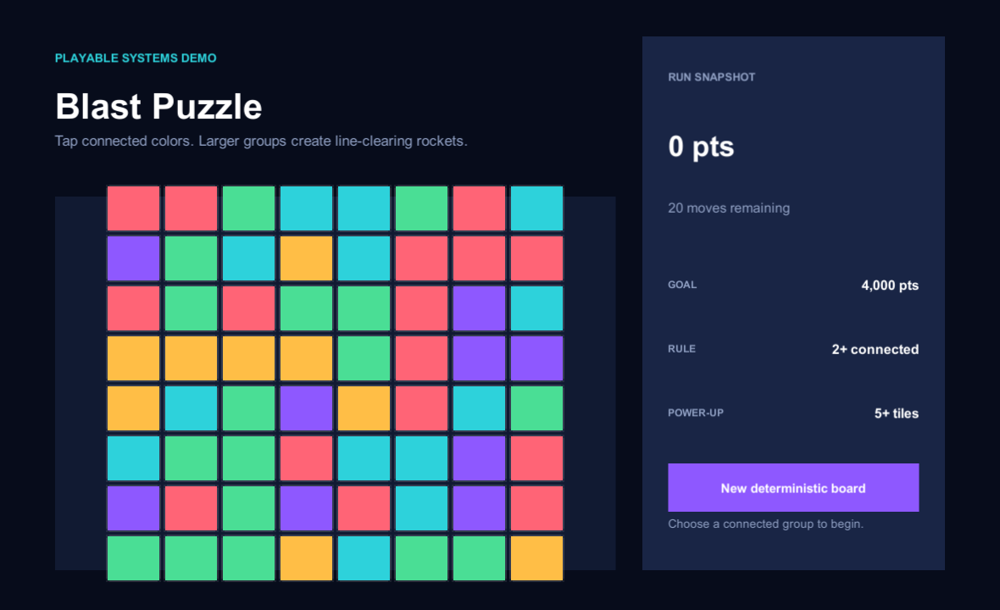

# Blast Puzzle Systems Demo

A playable Unity demo built around a deterministic, testable blast-puzzle
core. It shows connected-group detection, gravity, seeded refill, scoring and
line-clearing power-ups in a compact interface.

This is an independent engineering demo by Oguzhan Ozdemir. It uses original
code, generated UI primitives and no studio art, audio or branding.



## What to review

- `BlastBoard` is pure C#: gameplay rules run without a scene or frame timing.
- Breadth-first search finds orthogonally connected groups without recursion.
- Collapse and refill are deterministic for the same seed and player input.
- Large groups create rockets; results carry accepted state, removals, score
  and created power-up back to the presenter.
- Six EditMode tests cover invalid moves, cluster boundaries, gravity, seeded
  behavior and both power-up paths.
- The demo UI is generated from Unity primitives and has no runtime dependency
  beyond uGUI.

See [the architecture note](Docs/ARCHITECTURE.md) for boundaries and tradeoffs.

## Run

1. Install Unity **2022.3.61f1** with macOS build support.
2. Open the repository folder and let Unity restore the declared packages.
3. Choose **Demo > Create clean scene**, then enter Play Mode.
4. Select any group of two or more connected colors. Groups of five or more
   create a rocket.

The scene contains no serialized game state. A runtime bootstrap creates the
interface, so a clean clone remains reproducible.

## Test and build

```sh
UNITY="/Applications/Unity/Hub/Editor/2022.3.61f1/Unity.app/Contents/MacOS/Unity"
"$UNITY" -batchmode -projectPath "$PWD" -runTests -testPlatform editmode \
  -testResults "$PWD/Builds/editmode-results.xml" -quit

"$UNITY" -batchmode -projectPath "$PWD" -buildTarget StandaloneOSX \
  -executeMethod OguzhanOzdemir.BlastPuzzle.Editor.DemoProjectBuilder.BuildMac \
  -buildOutput "$PWD/Builds/macOS/BlastPuzzleDemo.app" -quit
```

## Provenance

The repository develops the gameplay-system idea from an older personal Unity
exercise. That earlier repository remains a private archive because it contains
task-specific art and unnecessary third-party packages. This clean project has
a fresh history and stands on its own.

MIT licensed.
